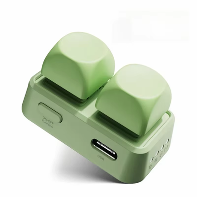
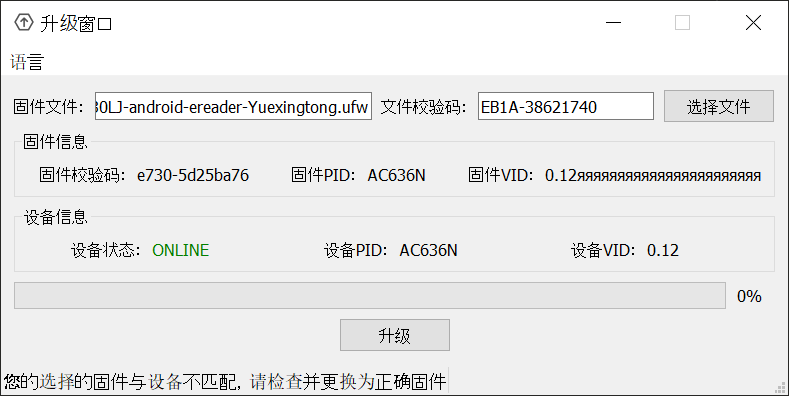

# UpdateFirmware VID Check Bypass Patch



A patch for the JieLi firmware updater used by **Free2 Bluetooth page turner** devices. Bypasses the VID (Version ID) check that fails due to a buffer handling bug in the DLL.

## Device Versions (VID)

The VID (Version ID) identifies the device hardware generation:

| Device Generation | VID | Buttons | Notes |
|-------------------|-----|---------|-------|
| **Free2** | 0.12 | 2 | Original version |
| **Free3** | 0.13 | 3 | Newer hardware |

> **⚠️ Warning:** Before flashing, verify that the **Device VID** and **Firmware VID** displayed in the updater match your device generation. This patch bypasses the VID check, but flashing firmware for the wrong hardware generation may brick your device. The DLL may not perform additional compatibility validation.

## Confirmed Working

| Device | Firmware | VID | Category |
|--------|----------|-----|----------|
| **Xteink X4** | E730LJ | 0.12 | Android e-readers, Yuexingtong |

## Downloads

| Resource | Link |
|----------|------|
| **Firmware (E730LJ)** | https://cdn.hanlinyue.com.cn/E730LJ.ufw |
| **Firmware Browser** | https://hanlinyue.com.cn/1755595121764 |
| **Updater App** | https://cdn.hanlinyue.com.cn/hanlinyue-win-1.2.3-ia32.exe |

> **Note:** If the sites don't open, try using a VPN (servers are located in China).

### Changing the App Language

The updater app defaults to Chinese. To switch to English:
1. Click the menu in the top-left corner (shows as "语言" or similar Chinese text)
2. Select your preferred language

### Locating UpdateFirmware.exe

After installing the updater app, `UpdateFirmware.exe` is located at:
```
C:\Users\<username>\AppData\Local\Programs\hanlinyue\resources\extraResources\exe\
```

Copy the patch scripts to that directory and run them there.

## The Problem

The JieLi firmware updater (`UpdateFirmware.exe`) refuses to flash firmware even when the device and firmware VID (Version ID) appear identical in the UI.



**Error Message:**
```
您的选择的固件与设备不匹配，请检查并更换为正确固件
(The firmware you selected does not match the device, please check and replace with the correct firmware)
```

## Root Cause Analysis

### The DLL Buffer Bug

The VID comparison fails due to a **buffer handling bug** in `jl_firmware_upgrade_x86.dll`. The two DLL functions that return VID strings behave differently:

| Function | Purpose | Buffer Behavior |
|----------|---------|-----------------|
| `JL_queryDevicePidVid` | Get device VID | ✓ Properly null-terminated |
| `JL_getUfwPidVid` | Get firmware VID | ✗ Fills with 0xFF, null at position 27 |

**What happens:**

1. **Device VID** (`JL_queryDevicePidVid`): Returns `"0.12\0\0\0..."` — clean, null at position 4
2. **Firmware VID** (`JL_getUfwPidVid`): Returns `"0.12\xFF\xFF\xFF..."` — garbage, null at position 27
3. EXE uses `QString::fromLocal8Bit(buffer, -1)` which reads until null byte
4. Device VID becomes `"0.12"` (clean) → `toFloat()` = **0.12**
5. Firmware VID becomes `"0.12яяяяяяяяяяя"` (garbage in Cyrillic) → `toFloat()` = **0.0** (parse failure)
6. Comparison: `0.12 < 0.01`? NO. `0.12 == 0.0`? NO. → **Error -30**

### Test Evidence (from test_dll)

```
Device VID buffer (JL_queryDevicePidVid):
  Hex: 30 2E 31 32 00 00 00 00 00 00 00 00...
  First null at: 4
  ASCII: "0.12"  ← CLEAN

Firmware VID buffer (JL_getUfwPidVid):
  Hex: 30 2E 31 32 FF FF FF FF FF FF FF FF...FF 00
  First null at: 27
  ASCII: "0.12......................."  ← GARBAGE (0xFF padding)
```

### The VID Comparison

The check occurs in function `sub_403750` at address `0x4037E2`:

```c
device_vid = QString::toFloat(label_device_vid->text());   // → 0.12 (clean)
firmware_vid = QString::toFloat(label_firmware_vid->text()); // → 0.0 (garbage parse fail)

if (device_vid < 0.01 || device_vid == firmware_vid) {
    // Allow upgrade
} else {
    return -30;  // Error: 0.12 < 0.01? NO. 0.12 == 0.0? NO.
}
```

The mismatch between clean device VID (0.12) and garbage firmware VID (0.0) causes the comparison to fail.

### Why It Works in Chinese Locale

Testing with [Locale Emulator](https://github.com/xupefei/Locale-Emulator) confirmed the bug is **locale-dependent**:

| Locale | Code Page | 0xFF Interpretation | Firmware VID Parse | Result |
|--------|-----------|---------------------|-------------------|--------|
| Chinese (Simplified) | 936 (GBK) | Multi-byte lead byte | Likely 0.12 or 0.0 | **Works** |
| Cyrillic (Russian) | 1251 | 'я' (valid character) | 0.0 (parse fail) | **Fails** |
| Western European | 1252 | 'ÿ' (valid character) | 0.0 (parse fail) | Likely fails |

In **GBK (Chinese)**, `0xFF` is a lead byte for multi-byte characters. When `QString::fromLocal8Bit()` encounters `0xFF` followed by invalid continuation bytes, Qt handles the error differently—either truncating the string or producing a result where both VIDs parse to the same value (both 0.12 or both 0.0), allowing the comparison to pass.

In **single-byte encodings** (CP1251, CP1252), `0xFF` is a valid standalone character. The firmware VID becomes a long garbage string that fails to parse (returns 0.0), while the device VID remains clean (parses to 0.12). This mismatch causes the error.

## The Patch

The patch changes the conditional jump to an **unconditional jump**, bypassing the VID comparison entirely:

| Item | Original | Patched |
|------|----------|---------|
| Address | `0x4037E2` (VA) / `0x2BE2` (file) | Same |
| Bytes | `7B 07` (`jnp +7`) | `EB 07` (`jmp +7`) |
| Effect | Jump if VIDs equal | Always jump (bypass check) |

This allows flashing any firmware regardless of VID mismatch, which is safe for compatible devices where only the version numbering differs.

## Workarounds

### Option 1: Use the Patched EXE (Recommended)

Download the pre-patched `UpdateFirmware.exe` from the [Releases](../../releases) section.

### Option 2: Use Locale Emulator

If you prefer not to patch the executable, you can run it with Chinese locale using [Locale Emulator](https://github.com/xupefei/Locale-Emulator):

1. Download and install [Locale Emulator](https://github.com/xupefei/Locale-Emulator/releases)
2. Run `LEInstaller.exe` and click "Install for current user"
3. Navigate to the UpdateFirmware.exe location:
   ```
   C:\Users\<username>\AppData\Local\Programs\hanlinyue\resources\extraResources\exe\
   ```
4. Right-click `UpdateFirmware.exe` → **Locale Emulator** → **Run with application profile**
5. Set **Location** to `Chinese (Simplified)` and click **Save**
6. The app will start and the profile is saved. Next time, just use **Run with application profile**

### Option 3: Apply the Patch Yourself

**PowerShell:**
```powershell
.\patch.ps1
```

**Command Prompt:**
```cmd
patch.cmd
```

Both scripts will:
1. Read `UpdateFirmware.exe` from the current directory
2. Patch byte at offset `0x2BE2`: `7B` → `EB`
3. Write `UpdateFirmware_patched.exe`

### Verify the Patch

```powershell
.\verify.ps1
```

## Technical Details

### Compatibility

This patch was developed for a specific version of the updater:

| Item | Value |
|------|-------|
| Updater App | hanlinyue-win-1.2.3-ia32 |
| Target File | `UpdateFirmware.exe` |
| SHA256 | `76924667c6a75fec3a34f8a432c643e5a8cced3e0bca07866f0d69d1d2431e90` |

> **Warning:** If your `UpdateFirmware.exe` has a different hash, the patch offset may be incorrect. Verify the hash before patching, or use the verify script after patching to confirm the correct bytes were modified.

### Patch Location

- **Virtual Address:** `0x4037E2`
- **File Offset:** `0x2BE2`
- **Section:** `.text`
- **Function:** `sub_403750` (manual flash handler)

### Patch Safety Notes

The patch only bypasses the **VID comparison** in the EXE. The actual firmware flashing is performed by the DLL (`jl_firmware_upgrade_x86.dll`).

> **⚠️ Important:** It is **not confirmed** whether the DLL performs additional hardware compatibility checks. Always verify that the displayed VIDs match your device generation (Free2 = 0.12, Free3 = 0.13) before flashing. Flashing firmware intended for a different hardware generation may cause permanent damage.

## Disclaimer

Use at your own risk. Flashing incompatible firmware can brick your device. This patch is intended for cases where the firmware is known to be compatible but the updater incorrectly rejects it due to version number formatting differences.
